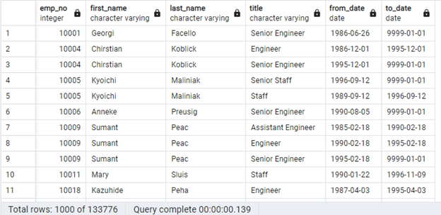

# Pewlett-Hackard-Analysis

## Overview of the project
Pewlett-Hackard is a large company with thousands of employees. Many of its "boomers" are looking to retire, and Pewlett-Hackard is looking toward the future by offering a retirement package for those who meet certain criteria and thinking about which positions need to be filled in the near future. The purpose of this analysis is to determine how many employees are in a position to retire, and how many employees could be eligible to participate in a mentorship program to help mentor new hires.

We will be gathering the required data by querying a database using SQL. Each of the two questions will be broken down into smaller sub questions as follows:

* I. Determine how many employees are in a position to retire and their titles
  * We will create a Retirement Titles table that holds all the titles of current employees who were born between January 1, 1952 and December 31, 1955.

  * Because some employees may have multiple titles in the database - due to promotions or internal transfers— we need to create a table that contains the most recent title of each employee.

  * Finally, we will create a final table that has the number of retirement-age employees grouped by most recent job title.

* II. Determine the employees eligible for the Mentorship Program
  * We will create a mentorship-eligibility table that holds the current employees who were born between January 1, 1965 and December 31, 1965.
  
  ## Results
  * Information on employees retiring in the near future 
 	 * Gets the employee number, first name, last name, title, title from date and title to date for each employee who was born between 1952 and 1995
	 * [Full Export]( https://github.com/shef1109/Pewlett-Hackard-Analysis/blob/723e1df7025ecf23c9826a3cb8f6ebc3266b188d/Data/retirement_titles.csv)
 	 * Data Sample
 	 
  
  
  * Current Titles of Employees 
   	 * Gets the employee number, first name, last name, and only the current title for each employee in the previous table 
	 * [Full Export]( https://github.com/shef1109/Pewlett-Hackard-Analysis/blob/723e1df7025ecf23c9826a3cb8f6ebc3266b188d/Data/retirement_titles.csv)
 	 * Data Sample
